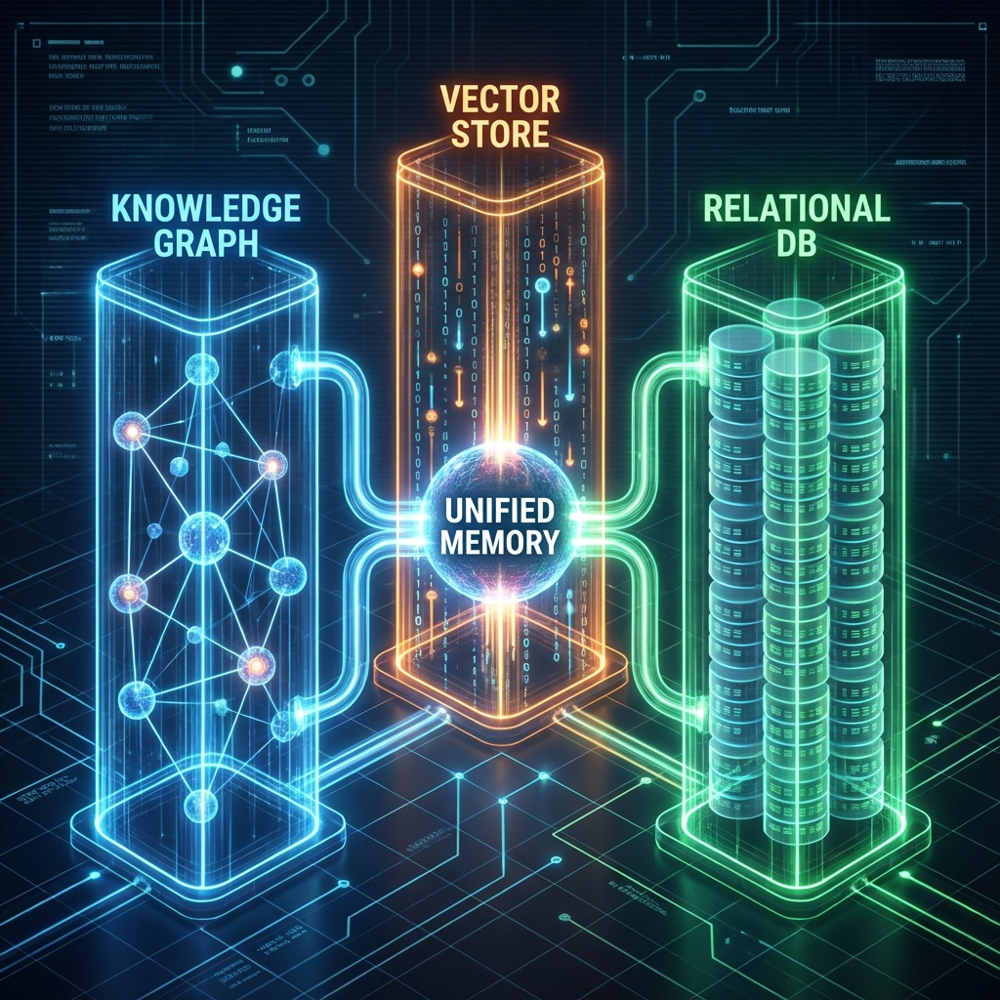
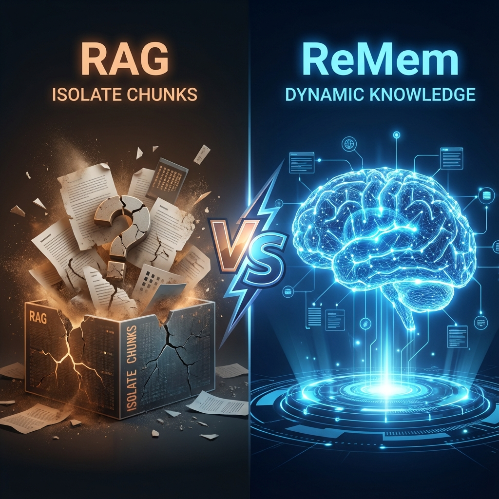

#  ReMem: Unified Modular Memory Mesh 🧠


**ReMem** is a local-first, privacy-focused persistent memory engine for AI agents. Built on the **Model Context Protocol (MCP)**, it gives LLMs the ability to "remember" facts, relationships, and context across sessions without tool bloat or context window exhaustion.



---

## 🚀 One Engine, Many Domains

Previously split into separate RPG and Coding projects, **ReMem Unified** uses a core **Modular Mesh Architecture**. This allows your AI to handle complex storytelling AND expert software engineering in a single session, dynamically loading only the tools it needs.

### ✨ The Modular Advantage
- **🧠 Unified Intelligence**: A single core for Graph, Vector, and SQL storage.
- **🧩 Dynamic context**: On-demand loading of domain-specific tools (RPG, Coding, etc.).
- **⚡ Local-Model Optimized**: Proven to run efficiently on 13b and 20b models by keeping the toolset lean.

---

## 🛑 The Problem: LLM Amnesia & Tool Bloat

Standard AI memory solutions suffer from two critical flaws:

1.  **Transient Context:** Once a conversation ends, the model forgets everything.
2.  **Tool Overload:** Giving a model too many tools (RPG + Coding + Math + Search) at once confuses the AI and eats up its limited context window.

---

## 🛡️ The Solution: The "Librarian" Intelligence

ReMem introduces the **Librarian Service**—a smart orchestration layer that manages the engine's cognitive load.

- **`librarian_suggest`**: Analyzes your current prompt and recommends exactly which module to activate.
- **On-the-Fly Expertise**: Switch from "Coding Mode" to "RPG Mode" instantly without restarting the server.
- **Zero Confusion**: Only relevant tools are exposed to the AI at any given time.

---

## 🆚 ReMem vs. Traditional RAG

| Feature | ❌ Standard RAG | ✅ ReMem (Modular Mesh) |
| :--- | :--- | :--- |
| **Understanding** | "These words are similar." | "These concepts are related." |
| **Updating** | **Static.** Facts often conflict. | **Dynamic.** Auto-updates graph nodes. |
| **Tool Footprint** | Static/Bloated. | **Lean.** Dynamic tool registration. |
| **Sync** | Often manual. | **Instant.** Unified infrastructure sync. |



---

## 🏠 Local-First Intelligence (LM Studio)

You can run ReMem entirely offline by using **LM Studio** as your provider for both the LLM and the Embedding model.

### 1. LM Studio Setup
- Download and install [LM Studio](https://lmstudio.ai/).
- Under the **Local Server** tab, load a Chat model (e.g., `Llama-3`) and an Embedding model (e.g., `nomic-embed-text-v1.5`).
- Ensure the server is running on `http://localhost:1234`.

### 2. Configure `.env`
Update your `.env` file in the `ReMem_Engine` directory:
```bash
OPENAI_BASE_URL=http://localhost:1234/v1
OPENAI_API_KEY=lm-studio
LLM_MODEL=model-identifier-from-lm-studio
EMBEDDING_MODEL=embedding-model-identifier
```

---

## 🧰 The Master Toolset

### Core Memory Tools
| Tool Name | Capability |
| :--- | :--- |
| **`auto_add_memory`** | **The Magic Button.** Extracts facts from any text and saves them to all three stores. |
| **`hybrid_search`** | **Deep Search.** Combines keyword matching with semantic meaning. |
| **`query_sql_db`** | **Data Analyst.** Runs real SQL queries for complex filtering. |

### Librarian Tools
| Tool Name | Capability |
| :--- | :--- |
| **`librarian_suggest`**| **The Orchestrator.** Recommends which expertise module to load. |
| **`activate_module`** | **Payload Expert.** Loads specialized tools (e.g., Coding or RPG). |
| **`list_modules`** | **Catalog.** Shows all available and active expert domains. |

---

## 🛠️ Installation & Usage

### Setup
1.  **Clone the repository:**
    ```bash
    git clone https://github.com/Gintoki571/ReMem.git
    cd ReMem/ReMem_Engine
    ```
2.  **Install & Build:**
    ```bash
    npm install
    npm run build
    ```

### Configuration
Update your MCP settings file:

```json
"remem": {
  "command": "node",
  "args": ["/absolute/path/to/ReMem/ReMem_Engine/dist/index.js"]
}
```

---

## 📂 Architecture
- `src/core`: Core graph and schema logic.
- `src/infrastructure`: Unified Database (SQLite) and Vector (LanceDB) management.
- `src/modules`: Domain-specific modular experts (RPG, Coding).
- `src/tests`: Comprehensive verification suite.

---

## 👨‍💻 Author
**Bindesh Kandel**
*Software Engineering Student & AI Enthusiast*

---
*Built with ❤️ using TypeScript, SQLite, and the Model Context Protocol.*
