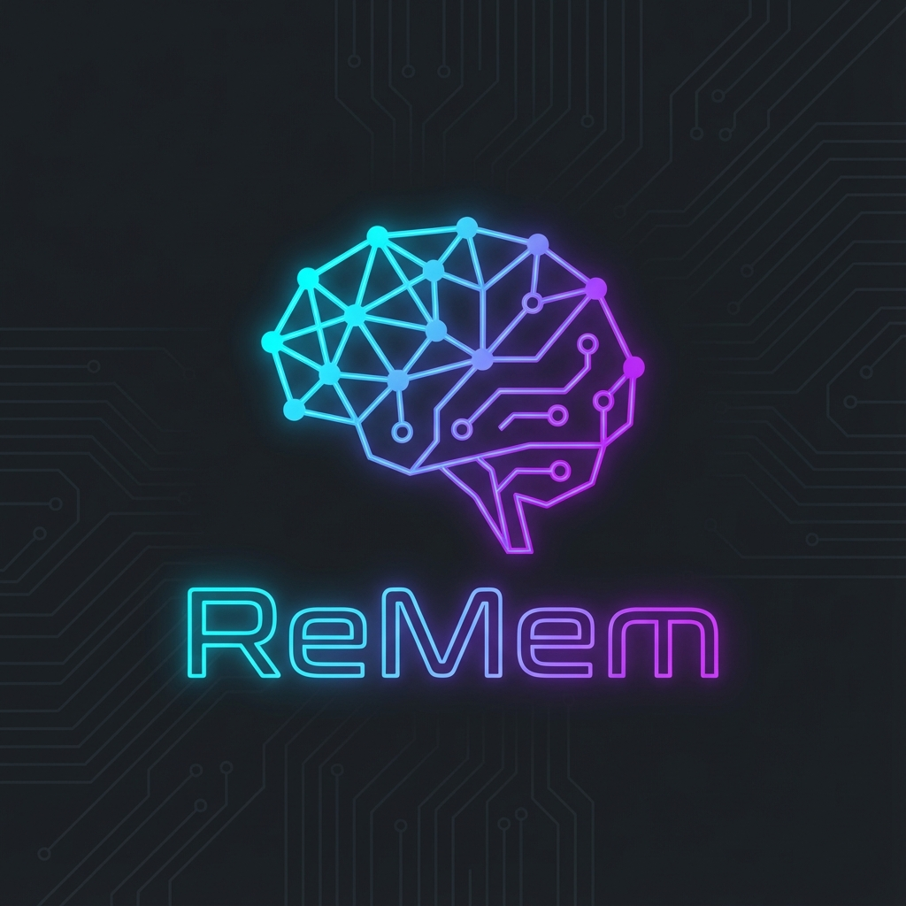
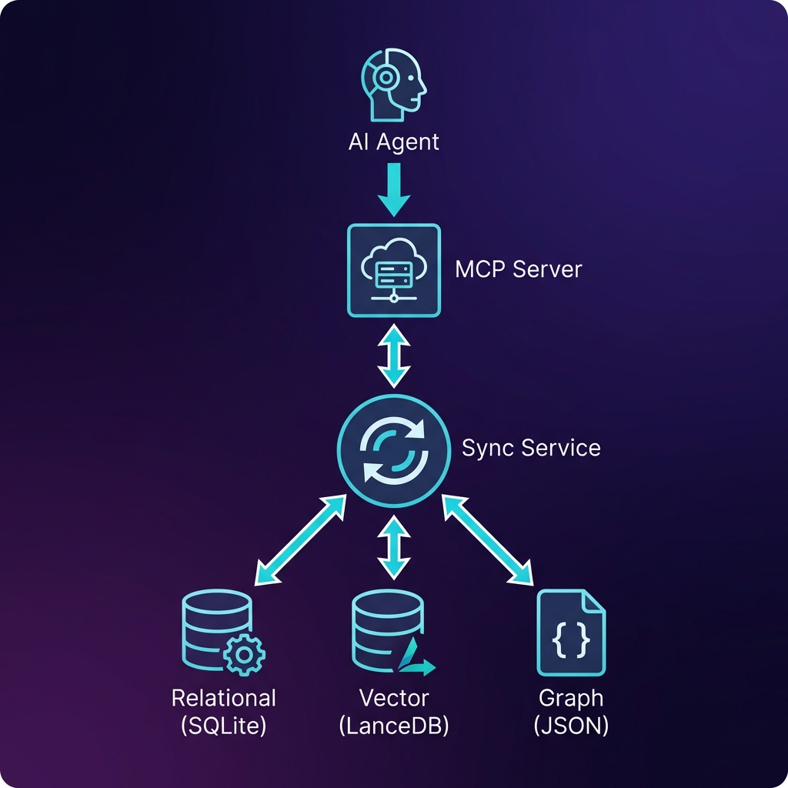
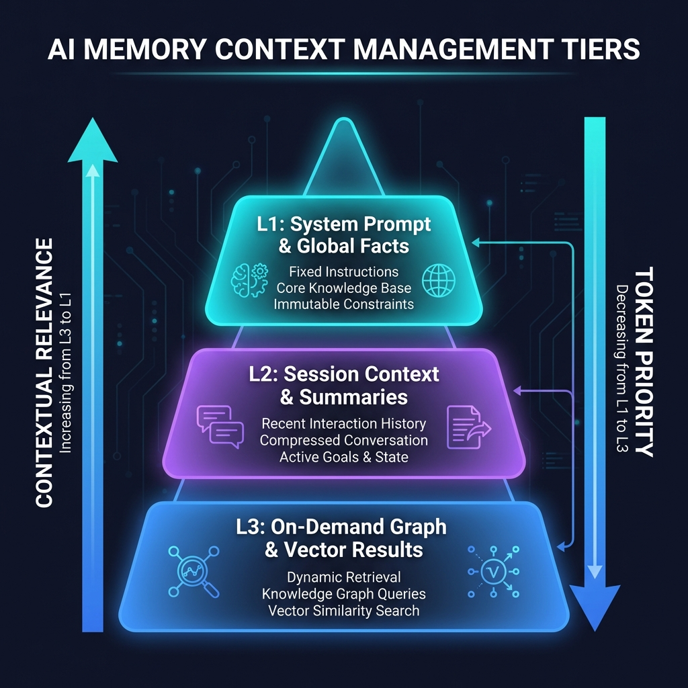
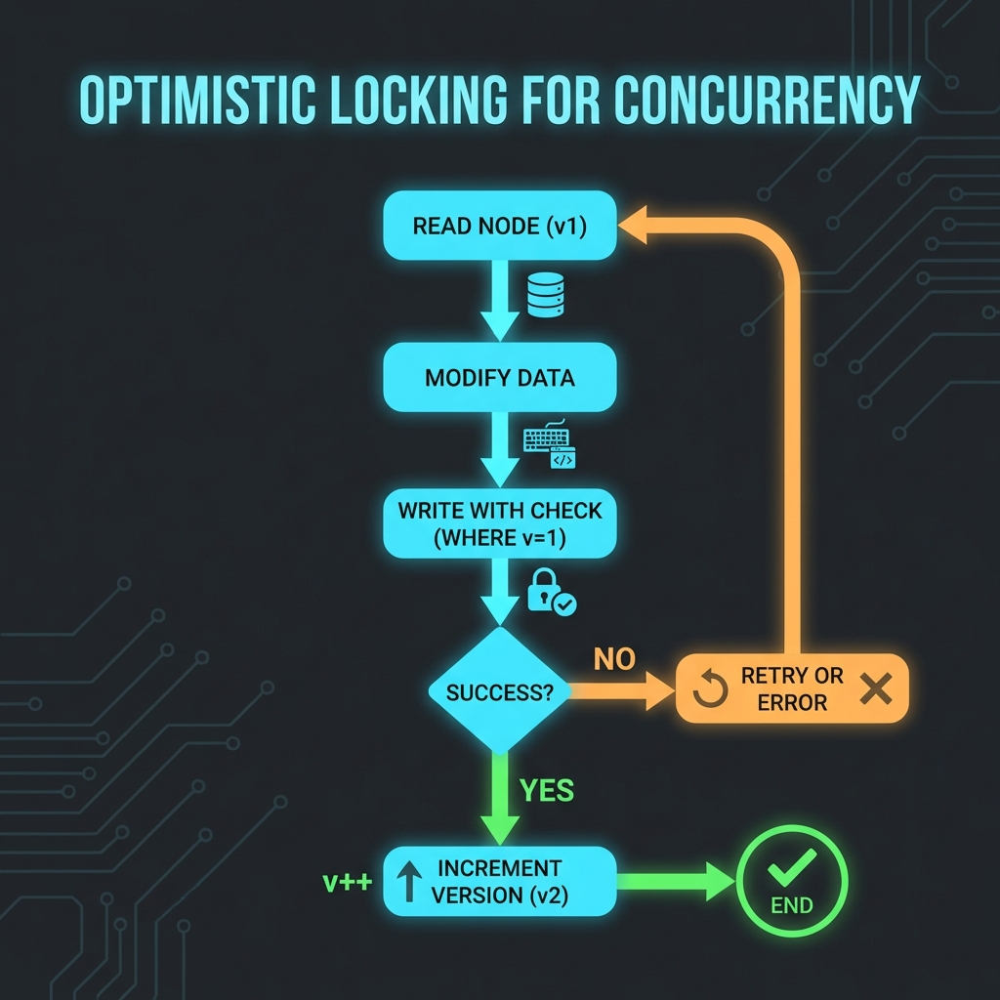

#  ReMem: Unified Modular Memory Mesh 🧠

## Versions

- `main`: v1 legacy engine.
- `v2` branch: TypeScript engine.
- `v3` branch (this branch): active Rust engine. See [README-v3.md](README-v3.md) and [docs/demo.md](docs/demo.md).

Quickstart (v3):

```sh
cargo build
./target/debug/remem remember semantic "prefers dark mode"
./target/debug/remem recall "dark mode"
```


**ReMem** is a local-first, privacy-focused persistent memory engine for AI agents. Built on the **Model Context Protocol (MCP)**, it gives LLMs the ability to "remember" facts, relationships, and context across sessions without tool bloat or context window exhaustion.

---

## 🌟 What's New (2026 Audit Edition)

This version of ReMem represents a complete **Production Hardening** pass, introducing enterprise-grade features for stability, security, and scalability.

### Key Highlights
| Feature | Description |
| :--- | :--- |
| 🛡️ **Optimistic Locking** | SQL-enforced concurrency control prevents data races during parallel writes. |
| 🏛️ **Tiered Context Management** | L1/L2/L3 context tiers ensure optimal token usage for any prompt size. |
| 🔒 **Security Hardening** | Zod-validated config, API key enforcement, and secret redaction in logs. |
| ⚡ **Batch Operations** | O(1) batch inserts for graph saves, replacing slow O(N) loops. |
| 🔄 **Sync Service Resilience** | Automatic retries with exponential backoff for all infrastructure sync. |
| 🔬 **MCP Protocol Stability** | All logs redirected to `stderr` to ensure clean `stdout` for JSON-RPC. |

---

## 📊 Architecture Overview

ReMem uses a **Triad Storage Architecture** to provide the best of all worlds:



1.  **Relational (SQLite)**: Structured storage with ACID transactions and complex queries.
2.  **Vector (LanceDB)**: Semantic search via embeddings for meaning-based retrieval.
3.  **Graph (JSON)**: Fast in-memory traversal for relationship discovery.

A **Sync Service** ensures all three stores are kept in perfect harmony.

---

## 🧠 Context Management Tiers

To prevent context window exhaustion, ReMem uses a tiered priority system:



| Tier | Contents | Use Case |
| :--- | :--- | :--- |
| **L1** | System Prompt & Global Facts | Always included in every call. |
| **L2** | Session Summary & Goals | Injected when relevant to the query. |
| **L3** | On-Demand Graph/Vector Results | Fetched dynamically via search tools. |

---

## 🔐 Production Hardening Features

### Optimistic Locking for Concurrency
ReMem prevents race conditions using SQL-based optimistic locking:



```sql
-- Example of versioned update
UPDATE nodes SET metadata = ?, version = version + 1
WHERE name = ? AND version = ?;
-- If rows affected = 0, a ConcurrencyError is thrown
```

### Saga Pattern for Atomic Operations
When creating nodes with vector embeddings, ReMem uses a "Saga" pattern:
1.  **Start SQL Transaction**
2.  **Insert Node into SQLite**
3.  **Generate & Store Vector**
4.  **Commit SQL Transaction**

If step 3 fails, the SQL changes are **rolled back**, ensuring no orphaned data.

### LLM Retry with Backoff
All LLM calls (summarization, memory extraction) now include automatic retries with exponential backoff to handle transient API failures.

---

## 🛠️ The Master Toolset

### Core Memory Tools
| Tool Name | Capability |
| :--- | :--- |
| **`auto_add_memory`** | **The Magic Button.** Extracts facts from any text and saves them to all three stores. |
| **`hybrid_search`** | **Deep Search.** Combines keyword matching with semantic meaning. |
| **`query_sql_db`** | **Data Analyst.** Runs real SQL queries for complex filtering. |
| **`health_check`** | **System Monitor.** Returns health status of DB, Vector Store, and Memory. |

### Librarian Tools
| Tool Name | Capability |
| :--- | :--- |
| **`librarian_suggest`**| **The Orchestrator.** Recommends which expertise module to load. |
| **`activate_module`** | **Payload Expert.** Loads specialized tools (e.g., Coding or RPG). |
| **`list_modules`** | **Catalog.** Shows all available and active expert domains. |

---

## 🏠 Local-First Intelligence (LM Studio)

You can run ReMem entirely offline by using **LM Studio** as your provider.

### 1. LM Studio Setup
- Download and install [LM Studio](https://lmstudio.ai/).
- Under the **Local Server** tab, load a Chat model (e.g., `Llama-3`) and an Embedding model (e.g., `nomic-embed-text-v1.5`).
- Ensure the server is running on `http://localhost:1234`.

### 2. Configure `.env`
```bash
OPENAI_BASE_URL=http://localhost:1234/v1
OPENAI_API_KEY=lm-studio
LLM_MODEL=model-identifier-from-lm-studio
EMBEDDING_MODEL=embedding-model-identifier
```

---

## 🛠️ Installation & Usage

### Setup
1.  **Clone the repository:**
    ```bash
    git clone https://github.com/Gintoki571/ReMem.git
    cd ReMem/ReMem_Engine
    ```
2.  **Install & Build:**
    ```bash
    npm install
    npm run build
    ```

### Configuration
Update your MCP settings file (e.g., `mcp_config.json`):

```json
"ReMem": {
  "command": "node",
  "args": ["/absolute/path/to/ReMem/ReMem_Engine/dist/index.js"]
}
```

---

## 📂 Architecture

```
src/
├── core/           # Graph, Schema, Context, and Logging
├── infrastructure/ # SQLite (Drizzle) and Vector (LanceDB) storage
├── application/    # Business logic (Analyzer, Managers)
├── integration/    # MCP Server & Tool Handlers
├── modules/        # Domain-specific experts (RPG, Coding)
└── tests/          # Comprehensive integration & unit tests
```

---

## 🧪 Verification Suite

ReMem includes a robust test suite covering:
- **Concurrency**: Optimistic locking under parallel write load.
- **Saga Rollback**: Atomic rollback on vector embedding failure.
- **Context Loop**: Rolling summary compaction.
- **Graph Traversal**: BFS and path-finding algorithms.

Run tests with:
```bash
npm run build
node dist/tests/integration/test_concurrency.js
node dist/tests/integration/test_saga_rollback.js
```

---

## 👨‍💻 Author
**Bindesh Kandel**
*Software Engineering Student & AI Enthusiast*

---
*Built with ❤️ using TypeScript, SQLite, and the Model Context Protocol.*
