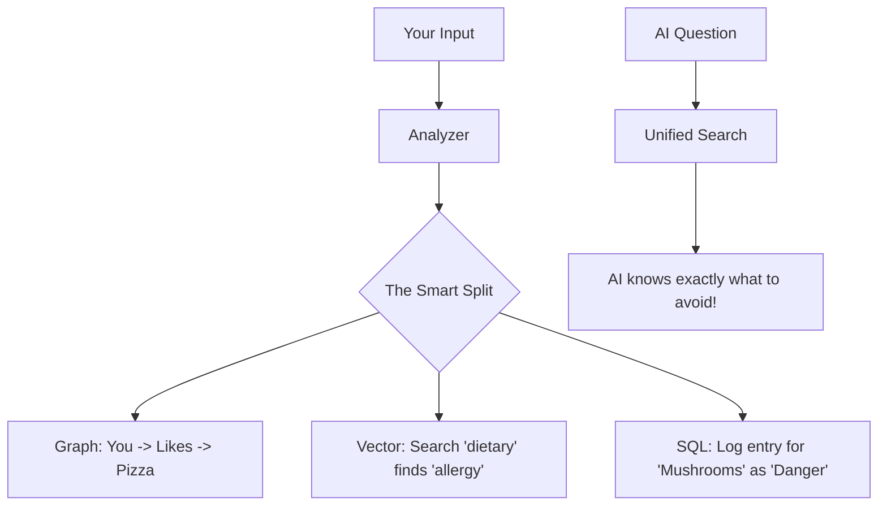

#  ReMem: The Memory Mesh 🧠


**ReMem** is a local-first, privacy-focused persistent memory server for AI agents. Built on the **Model Context Protocol (MCP)**, it gives LLMs the ability to "remember" facts, relationships, and context across sessions without relying on external cloud providers.


---

## 🛑 The Problem: LLM Amnesia

Large Language Models (LLMs) like Claude, GPT-4, and Gemini are incredibly powerful but suffer from a critical flaw: **Transient Context.**

1.  **No Persistence:** Once a conversation ends, the model forgets everything you told it.
2.  **Context Window Limits:** You cannot feed an entire Wikipedia into a prompt.
3.  **Lack of Structure:** Standard RAG (Retrieval Augmented Generation) often misses the "relationship" between data points (e.g., knowing that "Bindesh" *built* "ReMem").

---

## 🚀 The Solution: The "Triad" Architecture

ReMem solves this by implementing a **Memory Mesh**—a unified data layer that stores information in three complementary formats simultaneously.

### 1. The Knowledge Graph (JSON) 🕸️
**"Who is related to whom?"**
- Stores entities (Nodes) and their relationships (Edges).
- Tracks complex connections like "Alice knows Bob" or "Bob works at Google".

### 2. The Vector Store (LanceDB) 🧠
**"What is this conceptually about?"**
- Converts text into high-dimensional vector embeddings for **Semantic Search**.
- Finds "VS Code" when you search for "coding tools," even without exact keyword matches.

### 3. The Relational Database (SQLite) 📊
**"How many items do I have?"**
- Stores structured metadata, counts, and rigorous schemas for **SQL Queries**.
- Allows for precise filtering and complex aggregations.

---

## ✨ What's New in v0.3.0

### 🔄 Automated Infrastructure Sync
We've introduced the `InfrastructureSyncService`, which acts as the "nervous system" of ReMem. Every time you add a node or edge, the system **automatically** updates the SQL database and the Vector store. No manual synchronization is required!

### 🎯 Unified Tool Dispatch
All AI tool calls are now routed through a central `ToolsRegistry`. This ensures that every command is validated and processed with the same high level of error handling and reliability.

### ⚡ Essential Tools Mode
To save precious context space for the AI, ReMem now only exposes a minimalist set of "high-intelligence" tools. This keeps the model focused and prevents "tool bloat."

---

## 🆚 ReMem vs. Traditional RAG

Most AI memory solutions rely on **Standard RAG**, which simply finds text that "looks similar." ReMem implements **Dynamic Memory**.

| Feature | ❌ Standard RAG | ✅ ReMem (Dynamic Memory) |
| :--- | :--- | :--- |
| **Understanding** | "These words are similar." | "These concepts are related." |
| **Updating** | **Static.** Conflicting facts confuse the model. | **Dynamic.** Automatically updates or archives old nodes. |
| **Context** | Isolated chunks of text. | Connected Knowledge Graph (Everything overlaps). |
| **Sync** | Often manual and prone to lag. | **Instant.** Real-time infrastructure synchronization. |


---

## 🛠️ How it Works (Non-Technical)

Imagine you tell the AI: *"I love pizza, but I'm allergic to mushrooms."*




---

## 🧰 Smart Tools

| Tool Name | Capability |
| :--- | :--- |
| **`auto_add_memory`** | **The Magic Button.** Extracts facts from any text and saves them to all three stores. |
| **`hybrid_search`** | **Deep Search.** Combines keyword matching with semantic meaning for perfect retrieval. |
| **`query_sql_db`** | **Data Analyst.** Runs real SQL queries to find counts or specific filtered data. |
| **`semantic_search`** | **Concept Finder.** Finds memories based on meaning, even if words differ. |
| **`open_nodes`** | **Inspector.** Dives deep into the metadata of specific people, places, or things. |

---

## 📦 Installation & Usage

### Prerequisites
*   Node.js (v18+)
*   NPM

### Setup
1.  **Clone the repository:**
    ```bash
    git clone https://github.com/Gintoki571/ReMem.git
    cd ReMem/ReMem_RPG
    ```
2.  **Install Dependencies:**
    ```bash
    npm install
    ```
3.  **Build the Project:**
    ```bash
    npm run build
    ```

### Configuration
Add this to your MCP settings file:

```json
"remem": {
  "command": "node",
  "args": ["/absolute/path/to/ReMem/ReMem_RPG/dist/index.js"]
}
```

### Data Storage
Your data is stored locally for maximum privacy:
*   `data/ReMem_RPG.db` (SQL)
*   `data/lancedb/` (Vectors)
*   `data/memory.json` (Graph)

---

## 👨‍💻 Author
**Bindesh Kandel**
*Software Engineering Student & AI Enthusiast*

---
*Built with ❤️ using TypeScript, SQLite, and the Model Context Protocol.*
