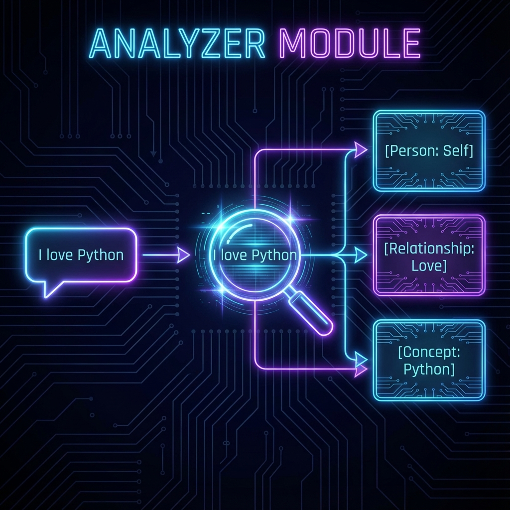

#  ReMem: The Memory Mesh 🧠


**ReMem** is a local-first, privacy-focused persistent memory server for AI agents. Built on the **Model Context Protocol (MCP)**, it gives LLMs the ability to "remember" facts, relationships, and context across sessions without relying on external cloud providers.


---

## 🛑 The Problem: LLM Amnesia

Large Language Models (LLMs) like Claude, GPT-4, and Gemini are incredibly powerful but suffer from a critical flaw: **Transient Context.**

1.  **No Persistence:** Once a conversation ends, the model forgets everything you told it.
2.  **Context Window Limits:** You cannot feed an entire Wikipedia into a prompt.
3.  **Lack of Structure:** Standard RAG (Retrieval Augmented Generation) often misses the "relationship" between data points (e.g., knowing that "Bindesh" *built* "ReMem").

## 🚀 The Solution: The "Triad" Architecture

ReMem solves this by implementing a **Memory Mesh**—a unified data layer that stores information in three complementary formats simultaneously. This ensures that no matter how you ask (keyword, concept, or relationship), the AI can find the answer.

### 1. The Knowledge Graph (JSON) 🕸️
**"Who is related to whom?"**
*   Stores entities (Nodes) and their relationships (Edges).
*   **Use Case:** Tracking complex relationships (e.g., "Alice knows Bob," "Bob works at Google").
*   **Tech:** Optimized JSON-based graph storage.

### 2. The Vector Store (LanceDB) 🧠
**"What is this conceptually about?"**
*   Converts text into high-dimensional vector embeddings.
*   **Use Case:** Semantic search. If you search for "coding tools," it will find "VS Code" even if the words don't match exactly.
*   **Tech:** **LanceDB** (Local, high-performance vector DB).

### 3. The Relational Database (SQLite) 📊
**"How many items do I have?"**
*   Stores structured metadata, counts, and rigorous schemas.
*   **Use Case:** Aggregations, filtering, and reliable backups.
*   **Tech:** **SQLite** with **Drizzle ORM**.

---

## 🆚 ReMem vs. Traditional RAG

Most AI memory solutions rely on **RAG (Retrieval Augmented Generation)**, which simply finds text that "looks similar" to your query. ReMem goes further by implementing **Dynamic Memory**.

| Feature | ❌ Standard RAG | ✅ ReMem (Dynamic Memory) |
| :--- | :--- | :--- |
| **Understanding** | "These words are similar." | "These concepts are related." |
| **Updating** | **Static.** conflicting facts confuse the model. | **Dynamic.** New facts can update or invalidate old nodes. |
| **Context** | Isolated chunks of text. | Connected Knowledge Graph (A leads to B). |
| **Structure** | Flat list of documents. | Structured Entities (Person, Project, Goal). |

**Example:**
*   **RAG:** You say "I love Adidas" (Day 1) and "I hate Adidas" (Day 30). RAG sees two conflicting documents and might retrieve either.
*   **ReMem:** The **Knowledge Graph** can capture that your *preference* node for "Adidas" has changed, or store the specific relationship context ("broke", "disappointment"), giving the AI the correct current answer.


---

## 🛠️ Architecture Deep Dive

### The Core: MCP Server
ReMem operates as an **MCP Server**. This means it can plug into any MCP-compliant client (like **VS Code**, **Claude Desktop**, or **Cursor**) standardizing how tools are exposed to the AI.

### The Analyzer Module
When you send a message to ReMem, it passes through the **Analyzer**:
1.  **Input:** "Bindesh is working on a TypeScript project called ReMem."
2.  **Extraction:** Regex and logic extract entities: `[Bindesh]`, `[ReMem]`, `[TypeScript]`.
3.  **Classification:**
    *   `Bindesh` -> `Person`
    *   `ReMem` -> `Project`
    *   `TypeScript` -> `Language`
4.  **Storage:** The system writes this to the **Triad** (Graph, Vector, SQL) automatically.



---

## 🧰 Tools Reference

ReMem exposes the following tools to the AI:

| Tool Name | Description |
| :--- | :--- |
| **`auto_add_memory`** | The "Magic Button". Takes raw text, extracts facts, and saves them to all three databases. |
| **`query_sql_db`** | Executes read-only SQL queries (`SELECT`) against the SQLite database. |
| **`read_graph`** | Reads the entire structure of the knowledge graph. |
| **`semantic_search`** | Searches for memories based on meaning (using Vector embeddings). |
| **`search_nodes`** | Finds specific nodes by name or type. |
| **`open_nodes`** | Retrieves detailed metadata for specific nodes. |

---

## 📦 Installation & Usage

### Prerequisites
*   Node.js (v18+)
*   NPM

### Setup
1.  **Clone the repository:**
    ```bash
    git clone https://github.com/Gintoki571/ReMem.git
    cd ReMem
    ```
2.  **Install Dependencies:**
    ```bash
    npm install
    ```
3.  **Build the Project:**
    ```bash
    npm run build
    ```

### Configuration (VS Code / Antigravity)
Add this to your MCP settings file (usually in `.gemini/antigravity/mcp_config.json` or `settings.json`):

```json
"memorymesh": {
  "command": "node",
  "args": ["/absolute/path/to/ReMem/dist/index.js"]
}
```

### Where is my data?
Your data is safely stored in the `data/` directory at the project root:
*   `data/memorymesh.db` (SQL)
*   `data/lancedb/` (Vectors)

---

## 👨‍💻 Author
**Bindesh Kandel**
*Software Engineering Student & AI Enthusiast*

---
*Built with ❤️ using TypeScript, SQLite, and the Model Context Protocol.*
